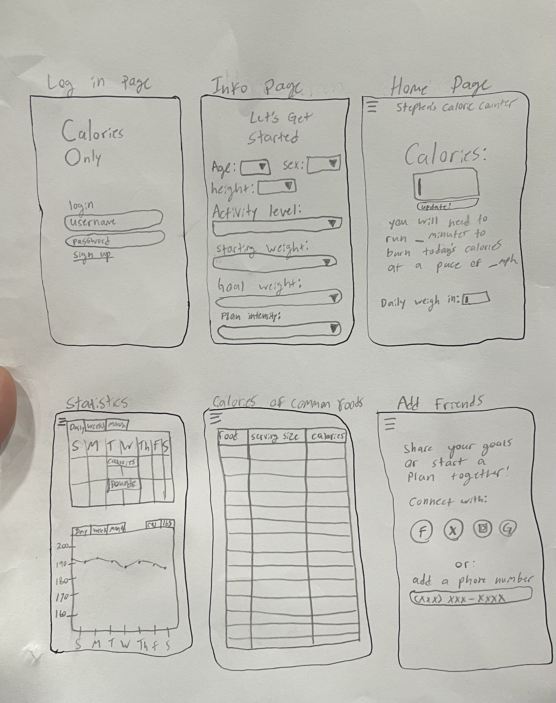

# Calories Only
Calories Only is a simple, quick, and easy-to-use calorie counter and weight-loss tracker.

## Specification Deliverable
### Elevator Pitch

When trying to lose weight, it can be easy to get lost in all the jargon and online or other sources telling you conflicting information. If you've found that simply counting calories works best for you and wish there was a good app to help you keep track of your caloric intake and weight-loss goals, then Calories Only is for you! Calories Only is just as the name implies, an app that counts your calories! After each meal simply add the calories to your profile and Calories Only will keep track of your daily amount of calories, how much exercise is required to burn those calories based on a small amount of pre-given information, send reminders to help you stay on top of your goals, and provide the calories of common foods so you can have everything you need all in one place to meet your weight-loss goals!

### Design

### Key Features

- Keeps track of how many calories you eat per day and stores the amount each day in a database, which can be accessed through the “previous caloric intake” section
- Allows you to add to or subtract from the total throughout the day
- Shares milestones with other users, such as, “Jamie reached her exercise goal”
- Allows competition and plans for groups to share in friendly weight-loss comparison or group goals
- Sets reminders to input calories at certain times of the day and before the day ends
- Provides a graphical representation of weight and goals
- Tells how long you would have to exercise (just walk/run) to burn the number of calories you ate each day and shows the approximate deficit of the day.
- Requests height, age, and gender from the user to determine how many calories will be burned by exercise.
- Provides information on the number of calories in common foods

### Technologies

I am going to use the required technologies in the following ways:

- **HTML** - 6 pages of HTML
- **CSS** - Will make the most beautiful yet simple use of colors and whitespace
- **JavaScript** - Make the button and drop-down menu animations and effects sleek
- **React** - Provides login, pulls up statistics, computes exercise needed to burn calories
- **WebService** - logs in users, retrieves previous caloric and weight data
- **DB/Login** - Store users and caloric data in a database, registers and log in users, and credentials are securely stored in a database.
- **WebSocket** - Sends goal and plan updates and milestones to friends of the user.

